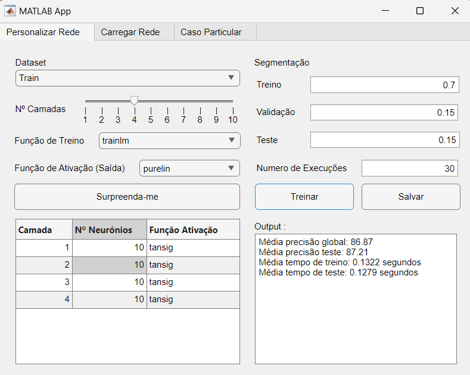
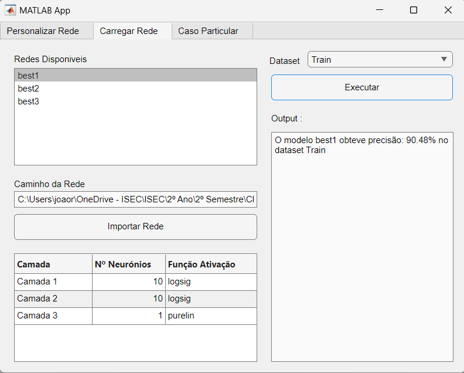

<<<<<<< HEAD
# Conhecimento-e-Raciocnio
Redes Neuronais Matlab
=======
# Previsão de Acidente Vascular Cerebral (AVC) com Redes Neuronais


## 🧠 Projeto de Redes Neuronais para Previsão de AVC

Este projeto foi desenvolvido no âmbito da unidade curricular de **Conhecimento e Raciocínio** da Licenciatura em Engenharia Informática. 

O principal objetivo deste trabalho foi estudar o impacto da arquitetura da rede, assim como das funções de treino e ativação, na taxa de sucesso das previsões durante o treino e teste. Também se analisou como um bom desempenho no treino pode não se refletir em boa generalização, evidenciando a importância de testar os modelos em novos dados.

Como bónus, foi desenvolvida uma aplicação gráfica que facilita a interação com o utilizador, oferecendo funcionalidades que permitem a personalização de redes neuronais, o carregamento de redes previamente treinadas, e a realização de previsões com base em atributos específicos de pacientes, como idade, género, hipertensão, doenças cardíacas, entre outros.

## 📊 Dataset Utilizado

O dataset escolhido foi o **Stroke Dataset**, que contém informações sobre pacientes e a probabilidade de ocorrência de AVC. O dataset inclui os seguintes atributos:
- **Gender:** Género do paciente.
- **Age:** Idade.
- **Hypertension:** Se o paciente tem hipertensão (1) ou não (0).
- **Heart Disease:** Se o paciente tem doença cardíaca (1) ou não (0).
- **Ever Married:** Estado civil.
- **Residence Type:** Tipo de residência (urbana ou rural).
- **AVG_Glucose_Level:** Nível médio de glicose.
- **BMI:** Índice de Massa Corporal.
- **Smoking Status:** Estado de fumador (Nunca fumou, Fumou anteriormente, Fumador, Desconhecido).
- **Stroke:** Se o paciente teve AVC (1) ou não (0).

## 🚀 Funcionalidades

### 1. **Personalização de Redes Neuronais**
Nesta secção, o utilizador pode configurar uma rede neuronal escolhendo o número de camadas, neurónios por camada, funções de ativação, e a divisão dos dados para treino, validação e teste. O sistema treina a rede e apresenta os resultados em termos de precisão.


### 2. **Carregamento de Redes**
O utilizador pode carregar redes previamente treinadas e visualizar as suas arquiteturas (número de camadas, neurónios e funções de ativação). A rede selecionada pode ser testada em novos datasets para avaliar a sua capacidade de generalização.


### 3. **Testes de Casos Específicos**
A interface permite introduzir os atributos de um paciente específico (idade, género, etc.) e prever se o paciente está em risco de sofrer um AVC com base na rede neuronal selecionada. Esta funcionalidade permite testar a precisão das previsões em casos individuais.


<!--
## ⚙️ Processo de Desenvolvimento

### Preparação do Dataset
Os dados foram inicialmente preparados convertendo atributos categóricos em valores numéricos (e.g., género, estado civil, estado de fumador) e preenchendo valores em falta utilizando uma abordagem baseada em similaridade com outros casos do dataset. A rede foi treinada com esses dados limpos e normalizados.

### Treino e Validação
Foram realizados múltiplos treinos com diferentes configurações de rede neuronal, variando o número de camadas, neurónios e funções de ativação. A melhor rede foi selecionada com base numa ponderação entre a precisão global e a precisão no conjunto de testes.

### Testes e Resultados
A precisão das redes variou, atingindo até **90% de precisão** em algumas configurações, mas destacando-se que a capacidade de generalização (testada com novos dados) foi um dos maiores desafios.
-->

## 📖 Estudo Detalhado

O desenvolvimento da aplicação foi baseado num estudo detalhado que incluiu a preparação dos datasets, a análise de diferentes arquiteturas de redes neuronais, e o impacto das funções de treino e ativação no desempenho dos modelos.

No relatório, é possível consultar:
- O processo de **preparação dos dados**, incluindo o tratamento de valores ausentes através de raciocínio baseado em casos.
- **Testes detalhados de desempenho** das redes neuronais, com diferentes configurações de camadas, funções de ativação e funções de treino.
- Resultados completos e análises dos **melhores modelos** desenvolvidos, bem como as lições aprendidas sobre a generalização dos modelos e o risco de overfitting.

Para mais detalhes sobre os métodos utilizados e os resultados obtidos, consulte o [relatório completo](estudo/RelatorioTP_CR.pdf).

## 🛠️ Como Executar
1. Clone o repositório para a sua máquina local:
   ```bash
   git clone https://github.com/joaorosapaiss/Conhecimento-e-Raciocinio.git
2. Abrir o MATLAB e navegar até à dirétoria do projeto.
3. Executar 'app1.mlapp' para iniciar a aplicação gráfica.
4. Experimente e explore! 🎉

## 📚 Referências

- [Documentação MATLAB](https://www.mathworks.com/help/matlab/)
- [Deep Learning Toolbox](https://www.mathworks.com/products/deep-learning.html)


>>>>>>> d2248f275d7344be4956dad84e0850dff0d7d296
